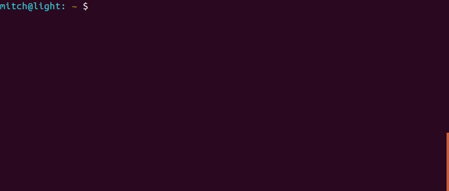

## Mitchell's development setup

Hello! If you've found this page, take a look around and hopefully you'll
learn something cool and new. 

## Desktop Environment
regolith-desktop
* https://regolith-linux.org/download/

## List of tested machines:
| Distribution | Status |
| ------------ | ------ |
| Ubuntu 20.10 |  Pass  |
| Ubuntu 20.04 |  Not Tested  |
| Ubuntu 18.04 |  Not Tested  |
| Ubuntu 16.04 |  Not Tested  |

## List of vim plugins installed:
| Plugin | Purpose |
| ------------ | ------ |
| YouCompleteMe | tab Autocompletion |
| vim-surround | automates characters surround text |

## Installing
To install everything onto a fresh machine run the following in the root directory:

```
$ ./mitchdz_dev_setup.sh
```

## bashrc color scheme example
The point of this addon to bashrc is to automatically show you which branch of
the git repository you are on. The below gif indicates what I'm talking about


## Features
### NerdTree
* Press <F10> while in vim to toggle open/close NERDTree.
    * While in NERDTree, press '<ctrl>+w h' to move to the left window, '<ctrl>+w l' to move to the right window.
    * While in NERDTree, press 's' on a file to open the file up vertically
### vim-monokai colorscheme in vim
### Modified ~/.bashrc PS1 coloring

## Extras
# Disabling tap to click
Tap to click is too sensitive, causing ghost clicks while typing on my laptop. To disable on startup,
```
sudo echo "synclient MaxTapTime=0" > /etc/profile.d/disable_tap_to_click.sh
```

